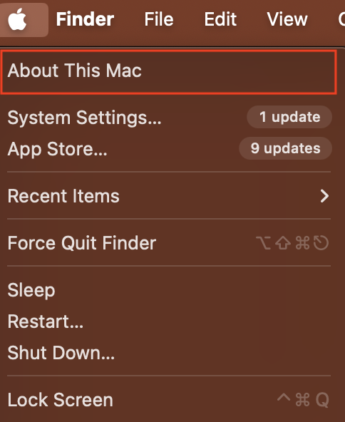
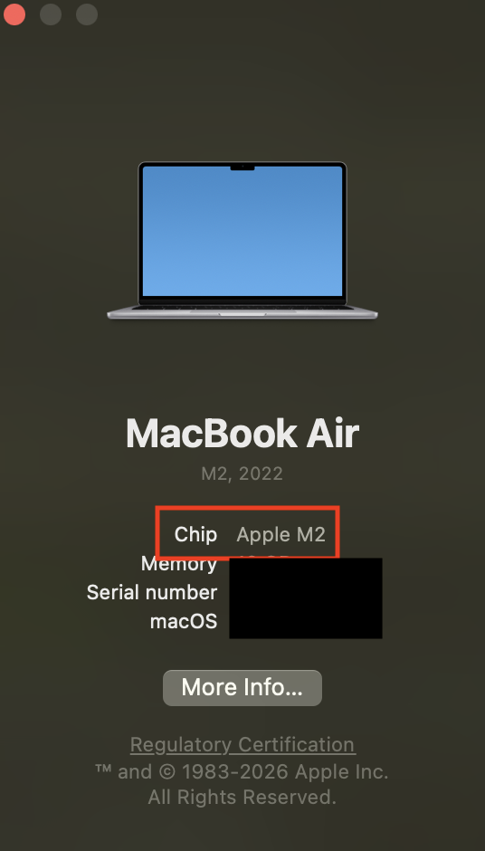

# HW1: UTF-8 Analyzer

To ensure everyone's code is graded fairly and compiled with the same version of `gcc`, we will be using [Docker](https://www.docker.com).

## Installing Docker:

1. Download Docker at https://docs.docker.com/get-started/get-docker/

2. Once Docker is downloaded, go through the intro tutorials that pop up just to familiarize yourself with it a bit.

### ATTENTION Mac users:

You need to check if your machine is running an Intel chip or an M-chip/A-chip (e.g., M1, M2, A18).

If you are using:

- Intel chip: Follow [Docker on Windows / x86 machines](#docker-on-windows--x86-machines)
- M-chip or A-chip: Follow [Docker on M-chip / A-chip Macs](#docker-on-m-chip--a-chip-macs)

#### How to check your Mac chip

You can click on the apple icon  in the top left of your menu bar, and click "About this Mac".



Then a window will appear, displaying what kind of chip you have.



Here we can see this machine uses an M2 chip.

## Docker on Windows / x86 machines

1. In your terminal (e.g., Windows Powershell), make sure you're in your project directory. Run the following command once to build your image:

```bash
   docker build -f Dockerfile -t utf8-runtime .
```

On Docker Desktop, you should see the Docker image under "images" in the sidebar

2. Every time you want to recompile and run your code, run this in your terminal:

```bash
   docker run --rm -it -v ${PWD}:/app utf8-runtime
```

## Docker on M-chip / A-chip Macs

1. In your terminal, make sure you're in your project directory. Run the following command once to build your image:

```bash
   docker build -f Dockerfile.arm -t utf8-runtime .
```

On Docker Desktop, you should see the Docker image under "images" in the sidebar

2. Every time you want to recompile and run your code, run this in your terminal:

```bash
   docker run --rm -it -v ${PWD}:/app utf8-runtime
```

## Troubleshooting Docker:

1. "Docker can't start because virtualization is not enabled"
   Make sure you have WSL installed on Windows: https://docs.docker.com/desktop/setup/install/windows-install/#wsl-verification-and-setup

2. Image isn't running:
   - Make sure to run the commands from your project directory
   - Make sure your path is right. Try running in the terminal `echo "$PWD"` to see the path. It should be to your project directory.
   - You might have renamed the `.c` file. Docker is looking for a file named `utf8_analyzer.c`.
